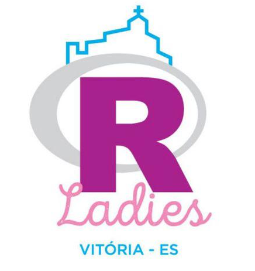
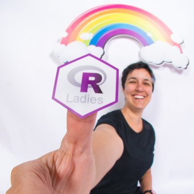
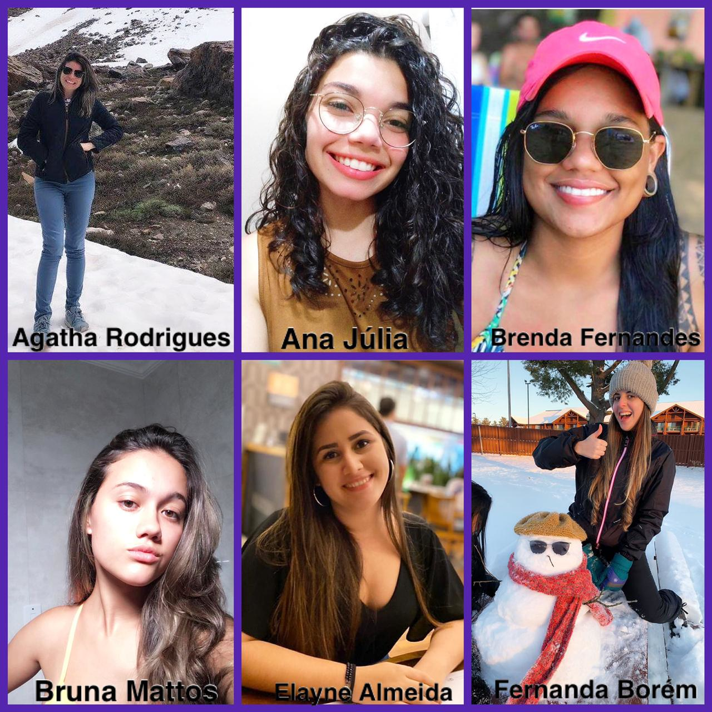

##Quem somos?

```{r logovix, echo=FALSE ,fig.align ='center',out.width = '30%'}

```

**Missão** 

<p style="text-align: justify;">R-Ladies é uma organização mundial cuja missão é promover a diversidade e equidade de gênero na comunidade R.</p>

**Objetivo**

<p style="text-align: justify;">Capacitar pessoas de gêneros sub-representados, criando e fortalecendo redes colaborativas dentro da comunidade R para que elas alcancem todas e quaisquer funções e áreas de participação no mundo da tecnologia.</p>

---

##Quem somos?

```{r logovix1, echo=FALSE ,fig.align ='center',out.width = '30%'}

```

**Como?**

* Promovendo meetups (encontros) e mentorias.

* Garantindo espaço amigável e seguro. 

**Capítulo R-Ladies Vitória**

O capítulo da cidade de Vitória foi criado em 29 de setembro de 2019.


Fonte: [**About us - R-Ladies.**](https://rladies.org/about-us/)

---
##O software R

```{r Rlogo, echo=FALSE ,fig.align ='center',out.width = '25%'}
knitr::include_graphics("img/Rlogo.png")
```

**O que é o R?**

* <p style="text-align: justify;">O R é um ambiente computacional e uma linguagem de programação que vem progressivamente se especializando em manipulação, análise e visualização gráfica de dados.</p>

* <p style="text-align: justify;">Este softaware apareceu inicialmente em 1996, com os professores de estatística Ross Ihaka e Robert Gentleman, da Universidade de Auckland, que desenvolveram essa nova linguagem computacional.</p>

* <p style="text-align: justify;">Na atualidade, o R é considerado o melhor ambiente computacional a ser utilizado por estatísticos e analistas de dados.</p>

---

##O software R

```{r Rlogo1, echo=FALSE ,fig.align ='center',out.width = '25%'}
knitr::include_graphics("img/Rlogo.png")
```

**Por que utilizar o R?**

* <p style="text-align: justify;">Software gratuito com código aberto e com uma linguagem acessível.</p>

* <p style="text-align: justify;">Se reinventa constantemente por meio de novas aplicações (aproximadamente 11.200 pacotes).</p>

* <p style="text-align: justify;">Por ser totalmente flexível, permite desenvolver facilmente funções e pacotes para facilitar o trabalho.</p>

* <p style="text-align: justify;">Capacidade gráfica e disponível para diferentes plataformas: Windows, Linux e Mac.</p>

Fonte: [**Introdução ao software R.**](https://www.abgconsultoria.com.br/blog/uma-breve-introducao-ao-software-r/)

---

```{r empolgado, echo=FALSE ,fig.align ='center',out.width = '100%'}

```

---
##Como surgiu a R-Ladies?

* <p style="text-align: justify;">A brasileira e estatística Gabriela de Queiroz fundou a R-Ladies no dia 1 de outubro de 2012 quando trabalhava no Vale do Silício (Califórnia) como uma forma de agradecer e retribuir à comunidade R todo o conhecimento adquirido gratuitamente em muitos encontros dos quais participou.</p>

* <p style="text-align: justify;">Mas foi a partir de 2016, quando a Gabriela, a Erin LeDell, a Chiin-
Rui Tan, a Alice Daish, a Hannah Frick, a Rachel Kirkham, a Claudia Vitolo e a Heather Turner se (re)uniram com o objetivo de fomentar a expansão global da organização, que nasceram vários e vários capítulos ao redor do mundo (incluindo nós, mais recentemente).</p>

```{r gabi, echo=FALSE ,fig.align ='center',out.width = '30%'}

```

Veja a reportagem sobre a Gabi no G1: [Gabi no G1](https://g1.globo.com/olha-que-legal/noticia/2019/03/23/a-brasileira-por-tras-de-uma-comunidade-que-ensina-programacao-para-mulheres-em-45-paises.ghtml)

Fonte: [**About us - R-Ladies.**](https://rladies.org/about-us/)

---
##Em quantos somos e onde estamos?
<p style="text-align: justify;">Hoje somos em quase 64 mil ladies em 184 cidades distribuídas em 51 países de todos os continentes.</p> 

```{r rmundo, echo=FALSE ,fig.align ='center',out.width = '80%'}
knitr::include_graphics("img/mapa.png")
```

Veja o mapa iterativo: [**R-Ladies Shiny App.**](https://gqueiroz.shinyapps.io/rshinylady/)

---
##Para quem e por que atuamos?

* <p style="text-align: justify;">Temos a finalidade de promover a linguagem de programação estatística R para pessoas com qualquer nível de conhecimento e que se identificam com o gênero feminino por meio de meetups em ambientes nos quais os participantes se sintam seguros e livres para se expressarem sem sofrer quaisquer tipo de represália ou assédio.</p>

* <p style="text-align: justify;"> A missão da R-Ladies é alcançar a representatividade igualitária dos gêneros sub-representados por meio da capacitação de pessoas que fazem parte desse grupo, a fim de que elas progridam individual e coletivamente dentro da comunidade R. Portanto, o objetivo da R-Ladies é apoiar pessoas de gêneros sub-representados e entusiastas da linguagem de programação R de forma que elas alcancem todas e quaisquer funções e áreas de participação e que contribuam para uma rede global colaborativa dentro da comunidade R. </p>

---
##Para quem e por que atuamos?

* <p style="text-align: justify;"> Além de promover a igualdade de gênero no mercado de trabalho e na área da ciência, visamos incentivar, inspirar e capacitar pessoas que são de grupos de minoria para que elas cresçam e inspirem mais jovens a fazerem o mesmo. E também para que elas possam alcançar seu potencial de programação, construindo uma rede global colaborativa de líderes, mentores, alunos e desenvolvedores de R para facilitar seu progresso individual e coletivo em todo o mundo. </p>

* <p style="text-align: justify;">Nosso objetivo é fazer com que esse movimento de mulheres e grupos de minoria cresça cada vez mais nessa área tão importante que é a da ciência.</p>

```{r emocionada, echo=FALSE ,fig.align ='center',out.width = '90%'}
knitr::include_graphics("img/emocionada.gif")
```

Fonte: [**About us - R-Ladies.**](https://rladies.org/about-us/) 

---
##Integrantes da R-Ladies Vitória

```{r todas1, echo=FALSE ,fig.align ='center',out.width = '70%'}

```

---
##Integrantes da R-Ladies Vitória

```{r todas2, echo=FALSE ,fig.align ='center',out.width = '70%'}

```

---
##Código de Conduta

<p style="text-align: justify;">A R-Ladies tem como objetivo proporcionar uma experiência livre de assédio para todos. Não toleramos nenhuma forma de assédio aos participantes.</p>

**Entende-se como assédio:**

* <p style="text-align: justify;">Comentários ofensivos relacionados ao gênero, identidade e expressão de gênero, orientação sexual, deficiência, doença mental, neuro-atipicidade, aparência física, tamanho corporal, idade, raça ou religião.</p>

* <p style="text-align: justify;">Comentários indesejáveis sobre as escolhas e práticas de estilo de vida, incluindo aquelas relacionadas com alimentos, saúde, parentalidade, drogas e emprego.</p>

* <p style="text-align: justify;">Ameaças de violência e incitação à violência contra qualquer indivíduo.</p>

* Perseguição ou invasão de privacidade.

* <p style="text-align: justify;">Padrão de contato social inadequado, como solicitar/assumir níveis inadequados de intimidade com os outros.</p>

---
##Código de Conduta

**Denúncia**

* <p style="text-align: justify;">Este código estende-se a qualquer espaço ou evento do R-Ladies.</p>

* <p style="text-align: justify;">Caso você seja assediado por um membro/convidado/participante em algum evento R-Ladies, ou ainda observe que alguém esteja sob assédio ou tem outras dúvidas, entre em contato conosco e realize sua denúncia.</p>

* <p style="text-align: justify;">Espera-se que o comportamento assediador seja interrompido imediatamente quando pedido.</p>

**Consequências**

* <p style="text-align: justify;">Qualquer pessoa que viole o código de conduta se comportando como assediador poderá ser advertida, punida ou até mesmo expulsa de todos os espaços do R-Ladies.</p>

Para mais informações, acesse o site: [**Código de Conduta.**](https://github.com/rladies/starter-kit/wiki/Code-of-Conduct#portuguese)

---
```{r encantado2, echo=FALSE ,fig.align ='center',out.width = '100%'}

```

---


##1º meetup da R-Ladies Vitória

<p style="text-align: justify;">Convidamos vocês a participarem do nosso primeiro encontro que será realizado no dia 19/03/2020!</p>


##Contatos e informações

* E-mail: vitoria@rladies.org

* Twitter: [https://www.twitter.com/rladiesvix.](https://www.twitter.com/rladiesvix)

* Instagram: [https://www.instagram.com/rladiesvix.](https://www.instagram.com/rladiesvix)

**Página dos meetups R-Ladies Vitória**

[https://www.meetup.com/pt-BR/rladies-vitoria/](https://www.meetup.com/pt-BR/rladies-vitoria/)

**Maiores informações**

[https://rladies.org/](https://rladies.org/)

---
##The End

      
```{r agradecimento, echo=FALSE ,fig.align ='center',out.width = '80%'}

```


